<p align="center">
  
</p>

<p align="center">
  <a href="https://github.com/Lourdhu02/tony-stark/actions/workflows/armory.yml"></a>
  <a href="https://github.com/Lourdhu02/tony-stark/actions/workflows/pages.yml"></a>
  <a href="https://lourdhu02.github.io/tony-stark/"></a>
  
  <a href="docs/papers.md"></a>
  <a href="LICENSE"></a>
  <a href="LICENSE-CONTENT.md"></a>
</p>

<p align="center"><code>wake up, engineer... the lab has you.</code></p>

<br>

### `> whoami`

ML engineer, going full-stack from first principles:
**silicon → kernels → firmware → control → robots → the AI that drives them.**

Thirteen **Marks**, like the suits. Every Mark is built from first principles, judged by measurable exit criteria, and written up.
No tutorial-following, and no finishing without proof.

### `> ./armory --status`

```text
 MARK  CODENAME            SYSTEMS                                     STATUS
 ────  ──────────────────  ──────────────────────────────────────────  ─────────
 I     BOX OF SCRAPS       c · syscalls · allocator · numerics         ▶ ACTIVE
 II    SILICON             nand → cpu · risc-v emulator in rust        · locked
 III   THE KERNEL          rust os on qemu · lock-free · epoll         · locked
 IV    ARC REACTOR         bare-metal stm32 · rtos · pid · pcb         · locked
 V     FLIGHT STABILIZERS  lqr · mpc · quadrotor sim from scratch      · locked
 VI    DUM-E               kinematics · mujoco · ros 2 · pick & place  · locked
 VII   AUTOPILOT           ekf · particle filter · slam · planning     · locked
 VIII  HUD                 cuda kernels · edge perception · tensorrt   · locked
 IX    J.A.R.V.I.S.        voice → llm agent → robot, safely           · locked
 X     SUIT UP             capstone: integrate everything              · locked
 ────  PHASE 5 · ADVANCED ROBOTICS (YEAR 2) ─────────────────────────────────────────
 XI    BLUEPRINT           lie groups · rnea · crba · aba · contact    ◇ textbook + lab ready
 XII   HULKBUSTER          ddp · mpc · centroidal · whole-body qp      · locked
 XIII  EXTREMIS            ppo · sac · sim-to-real · diffusion · vla   · locked
```

<sub>Dossiers: [I](marks/mark-01-box-of-scraps) · [II](marks/mark-02-silicon) · [III](marks/mark-03-the-kernel) · [IV](marks/mark-04-arc-reactor) · [V](marks/mark-05-flight-stabilizers) · [VI](marks/mark-06-dum-e) · [VII](marks/mark-07-autopilot) · [VIII](marks/mark-08-hud) · [IX](marks/mark-09-jarvis) · [X](marks/mark-10-suit-up) · [XI](marks/mark-11-blueprint) · [XII](marks/mark-12-hulkbuster) · [XIII](marks/mark-13-extremis) · every Mark is fully planned; code scaffolding unlocks as you reach it.</sub>

### `> cat start_here`

```text
01  read docs/method.md                    the weekly loop, and how to get unstuck
02  score docs/self-assessment.md          your baseline, as a number
03  open marks/mark-01-box-of-scraps       the syllabus for weeks 1–6
04  read notes/01-memory-hierarchy.md      theory before code
05  make -C marks/mark-01-box-of-scraps test
```

### `> du -sh knowledge/`

| Layer | What's inside |
|---|---|
| [**Dossiers ×13**](ROADMAP.md#the-thirteen-marks) | a week-by-week syllabus (128 weeks across 5 phases), system specs with numeric exit criteria, pitfalls, a boss fight per Mark |
| [**Advanced robotics textbook**](marks/mark-11-blueprint/chapters) | 9 graduate chapters with full derivations: Lie groups, Newton–Euler, RNEA, CRBA, passivity, ABA, contact · a 42-test lab validated against physics |
| [**Field manuals ×5**](marks/mark-01-box-of-scraps/notes) | derivations and diagrams: caches, LU and floating point, integrators, allocators, processes and signals |
| **Project briefs ×7** ([Mark I](marks/mark-01-box-of-scraps), [Mark XI](marks/mark-11-blueprint)) | specs + **32 progressive hints** (nudge → approach → algorithm, never code) |
| **Recall** | **100 quiz questions** with worked answers · **65 interview questions** |
| [**Skill tree**](docs/skill-tree.md) | what unlocks what, and where your ML background plugs in |
| [**Library**](docs/library.md) | every book and course, mapped to Marks and chapters |
| [**Self-assessment**](docs/self-assessment.md) | 16 domains × 6 levels: your Stark score, re-scored after every Mark |

### `> ls .claude/agents/`

Six AI tutors ship with the repo as Claude Code subagents. They're built around one rule: **you write the solutions.**

```text
tutor                  stuck? climbs the hint ladder, asks before it tells       · never writes your code
reviewer               senior-engineer review of a finished system               · never rewrites it
quizmaster             Sunday spaced retrieval from finished Marks               · never shows answers first
paper-guide            three-pass reading plans for any REFERENCES.md entry      · never invents details
lab-scribe             drafts the weekly note from git + test results            · never invents learnings
curriculum-architect   builds new Marks to the lab's validation standard         · never commits solutions
```

→ [`.claude/README.md`](.claude/README.md) · repo rules for any assistant: [`CLAUDE.md`](CLAUDE.md)

### `> cat papers.idx`

Every knowledge folder has an annotated **`REFERENCES.md`** saying *why* each work matters there, *what* to read, and how hard it is (★☆☆ → ★★★). There are 266 works from 1927 to 2025, generated from one [verified catalog](tools/refs/catalog.py) and checked for freshness in CI.

| Start with | Then |
|---|---|
| [The canon](marks/REFERENCES.md): 12 works every roboticist should know | [Master index](docs/papers.md): chronological, with back-links |
| [How to read a paper](docs/papers.md#how-to-read-a-paper): the three-pass method | [Learning science](docs/REFERENCES.md): why the method works |

### `> cat boot_sequence`

```sh
git clone https://github.com/Lourdhu02/tony-stark && cd tony-stark
make -C marks/mark-01-box-of-scraps test
```

```text
  ┌──────────────────────────────────────────────────────────┐
  │ STARK INDUSTRIES // ARMORY DIAGNOSTICS                   │
  └──────────────────────────────────────────────────────────┘

  MARK 01 · BOX OF SCRAPS

  01-linalg    ░░░░░░░░░░░░░░░░░░░░░░░░   0/14  OFFLINE
  02-sim       ░░░░░░░░░░░░░░░░░░░░░░░░   0/13  OFFLINE
  03-malloc    ░░░░░░░░░░░░░░░░░░░░░░░░   0/19  OFFLINE
  04-shell     ░░░░░░░░░░░░░░░░░░░░░░░░   0/33  OFFLINE

  ░░░░░░░░░░░░░░░░░░░░░░░░░░░░░░░░░░░░░░░░  0%  0/79 systems nominal
```

Every bar starts empty. The tests are the spec: fill them.

### `> cat protocols.txt`

```text
01  build it from scratch first, then use the library.
02  a mark ends with a demo and a write-up, not with a finished tutorial.
03  exit criteria are numbers.
04  tests + ci from day one. a completed system never regresses.
05  one lab note per week.
```

### `> tree -L 2`

```text
tony-stark/
├── ROADMAP.md            overview: thirteen Marks, five phases, timeline
├── HARDWARE.md           what to buy, when, and how not to set it on fire
├── docs/                 method · skill tree · library · self-assessment · papers index
├── marks/
│   ├── mark-01-box-of-scraps/   ▶ active: 4 systems, 79 tests, field manuals
│   ├── mark-02 … mark-10/       dossiers (code unlocks when you arrive)
│   ├── mark-11-blueprint/       ◇ advanced robotics textbook (9 chapters) + 42-test lab
│   └── mark-12, mark-13/        dossiers: optimal control and legged robots, robot learning
├── lab-notes/            weekly log (copy TEMPLATE.md)
├── tools/                armory.sh (test dashboard) · refs/ (reference catalog + generator)
├── site/                 MkDocs Material site → GitHub Pages
├── .claude/agents/       six AI tutors (Claude Code subagents)
└── .github/              ci (armory, pages) · issue/PR templates · dependabot
```

### `> man tony-stark`

| | |
|---|---|
| **Plan** | [`ROADMAP.md`](ROADMAP.md): five phases, thirteen Marks; Year 1 builds the stack, Year 2 goes deep into advanced robotics |
| **Method** | [`docs/method.md`](docs/method.md): read → derive → build → measure → teach → review |
| **Now** | [`Mark I · Box of Scraps`](marks/mark-01-box-of-scraps): matrix library, physics sim, `malloc`, a Unix shell |
| **Kit** | [`HARDWARE.md`](HARDWARE.md): nothing needed until Mark IV |
| **Log** | [`lab-notes/`](lab-notes) |

### `> cat LICENSE*`

Code: [MIT](LICENSE) · Content (chapters, manuals, dossiers, annotations): [CC BY 4.0](LICENSE-CONTENT.md) · Cite it with [`CITATION.cff`](CITATION.cff) (GitHub's **Cite this repository** button).
Contributions welcome: errata, test bugs and papers. Never solutions. See [CONTRIBUTING](CONTRIBUTING.md) · [Code of Conduct](CODE_OF_CONDUCT.md) · [Security](SECURITY.md).

<br>

<p align="center"><sub><code>[ EOF ] built in a cave, with a box of scraps.</code></sub></p>
