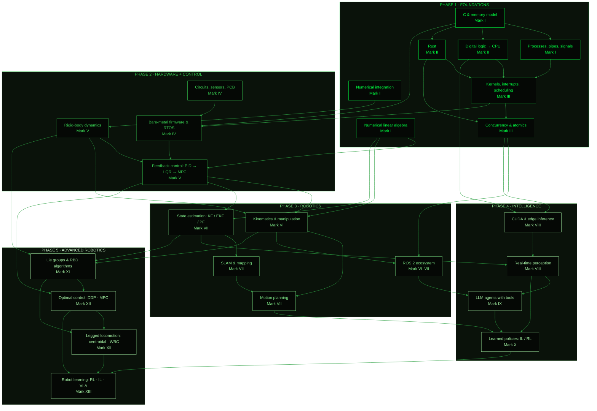

# Skill tree

> Every capability in this lab unlocks something downstream. This page shows what each piece of knowledge is *for*, so you never study something without knowing why.

## The whole tree

## Why each edge exists

| From → To | Because |
|---|---|
| C → Processes | `fork`, `exec`, `pipe` and `dup2` are C APIs over kernel objects. You can't reason about them without pointers and file descriptors. |
| Digital logic → Kernels | Interrupts, privilege levels and page tables are hardware features. The kernel is software that choreographs them. |
| Numerical integration → Rigid-body dynamics | Every simulator is `state += f(state)·dt` done carefully. Mark I's pendulum is the seed of Mark V's quadrotor. |
| Linear algebra → Control | LQR is a Riccati equation. Controllability is a matrix rank. Stability is eigenvalues. |
| Linear algebra → State estimation | A Kalman filter is linear algebra plus Gaussians: `K = P·Hᵀ·(H·P·Hᵀ + R)⁻¹`. |
| Control → State estimation | Estimation is the mathematical dual of control: the Kalman filter's Riccati equation is LQR's, transposed. The separation principle then lets you design the two independently (LQG). |
| Firmware → Control | A controller running at 1 kHz with 200 µs of jitter is a different controller. Timing is part of the math. |
| Concurrency → ROS 2 | ROS 2 is callbacks, executors, QoS and shared memory. It's a concurrency framework wearing a robotics hat. |
| Computer architecture → CUDA | GPU performance is about memory hierarchy, coalescing and occupancy, which is Mark I's cache lesson at 1000× scale. |
| Perception + ROS → Agents | JARVIS can only act on a world it can perceive, through interfaces the robot exposes. |
| Dynamics + Kinematics + Estimation → RBD algorithms (XI) | Mark XI derives, from first principles, the machinery Marks V–VII used as black boxes |
| RBD + Control → Optimal control (XII) | iLQR/DDP and MPC differentiate and roll out exactly the RNEA/ABA you wrote in Mark XI |
| Optimal control → Robot learning (XIII) | RL approximates the same Bellman equation; the MPC controllers become baselines, experts and teachers for learned policies |

## Your ML head start

You already have strong nodes in this tree that most robotics engineers don't. Here's where they plug in:

| You already know | It becomes |
|---|---|
| Gradient descent, Adam | Trajectory optimization, nonlinear least squares (Gauss–Newton, Levenberg–Marquardt) for SLAM |
| Probabilistic models, Bayes | Bayes filters: the Kalman filter is a closed-form Bayesian update |
| Backprop, autodiff | Jacobians for EKF and IK, and differentiable simulation |
| Training loops, eval discipline | Measurable exit criteria, benchmark suites, sim-to-real evaluation |
| PyTorch / TensorRT / Triton serving | Mark VIII edge deployment on day one |
| Transformers, VLMs | Mark IX agents and Mark X vision-language-action policies |

The Marks deliberately spend most of your time on the nodes you don't have yet (the left and middle of the tree) and move fast through the nodes you do.
